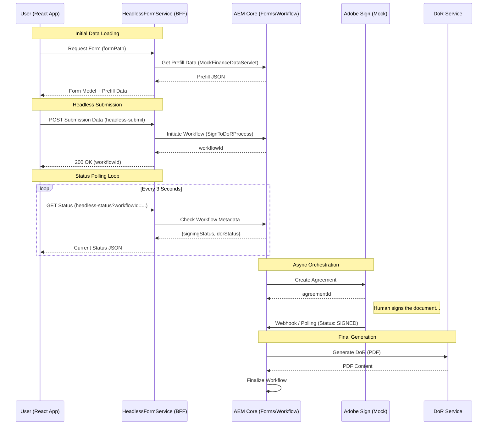

# Omnichannel Sign & DoR Architecture

This document describes the high-level architecture for the headless AEM Forms lifecycle, from initial data pre-fill to final signing and document generation.

## Sequence Diagram

## Component Roles

| Component | Responsibility |
| :--- | :--- |
| **HeadlessFormService** | Orchestrates pre-fill, submission, and status polling (BFF). |
| **SignToDoRProcess** | AEM Workflow process managing the long-running async lifecycle. |
| **AdobeSignOrchestrator** | Mock service simulating the Adobe Sign API and status transitions. |
| **Prefill Orchestrator** | Maps enterprise data to the form fields before the user sees the form. |
